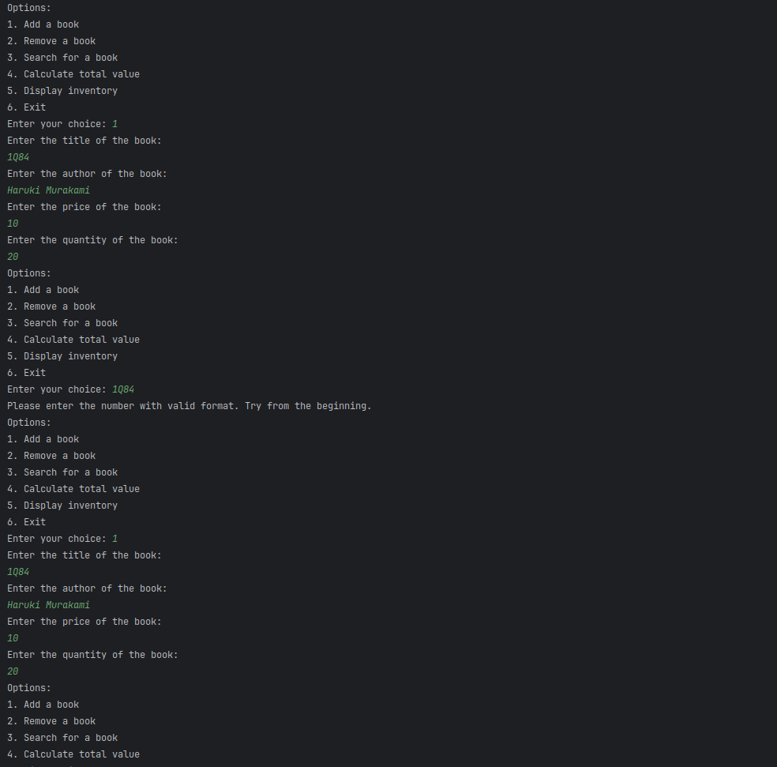
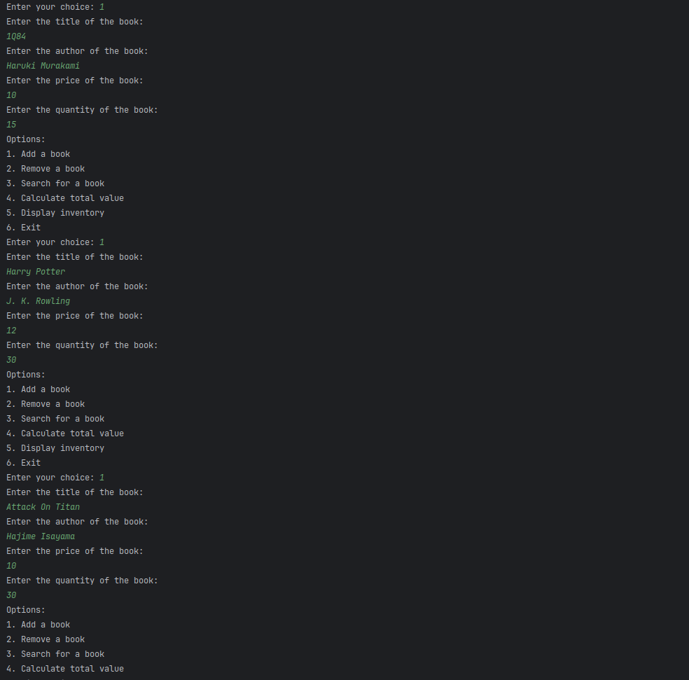
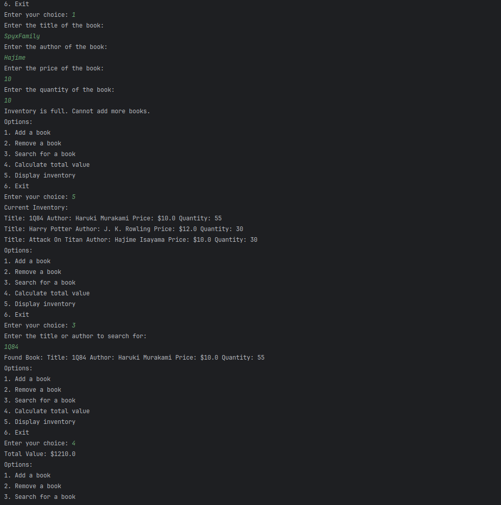
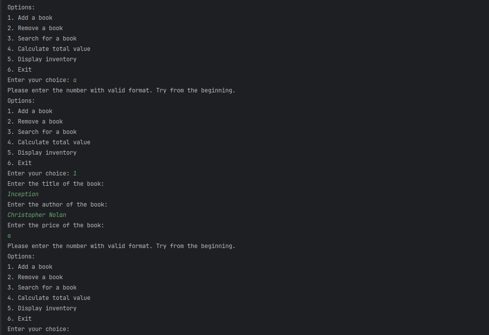

### First Of All
I copied my code from my assignment for the online course that is private repository on GitHub. Therefore, I upload whole my code with one git commit.

---
### Level of Difficulty: Intermediate
### Title: Advanced Online Bookstore Inventory Management System
### Overview:
In this assignment, you will be creating an advanced inventory management system for an online bookstore. The system will be able to add books, remove books, and display the current inventory. Each book will have a title, author, price, and quantity in stock. You will be using access modifiers, packages, and 1D and 2D arrays to accomplish this task.

**Step Guidance:**
1. Accept the GitHub Classroom invitation that was sent to your email. This will create a new repository for you to submit your assignment.
2. Clone the repository to your local machine using the command `git clone [repository url]`.
3. Inside the cloned repository, navigate to the `src/com` directory. This is where you will add your solution.
4. Create a new package named `bookstore`. Inside this package, create two classes: `Book` and `Inventory`.
5. In the `Book` class, declare private attributes for title, author, price, and quantity in stock. Include a constructor to initialize these attributes, getters and setters to access and modify them, and a toString method to display the book information.
6. In the `Inventory` class, declare a private 1D array of `Book` objects. This array will represent the books in the inventory. Include methods to add a book (which should add a `Book` object to the array), remove a book (which should remove a `Book` object from the array based on the title), and display the current inventory (which should print all the `Book` objects in the array).
7. In the main method, which should be in a separate class in the default package, create an instance of the `Inventory` class and add some books to the inventory. Then display the inventory, remove a book, and display the inventory again to ensure everything is working correctly.
8. Once you have completed your solution, commit your changes using the command `git commit -m "Completed assignment"`.
9. Push your changes to the repository using the command `git push origin master`.
10. Make sure to complete these steps before Wednesday, 1st November.

**Examples:**
*Input:*
Add Book: ("Harry Potter", "J.K. Rowling", 39.99, 10)
Add Book: ("The Hobbit", "J.R.R. Tolkien", 29.99, 5)
Display Inventory
Remove Book: "Harry Potter"
Display Inventory

*Output:*
Inventory:
Harry Potter by J.K. Rowling, Price: $39.99, Quantity: 10
The Hobbit by J.R.R. Tolkien, Price: $29.99, Quantity: 5

Inventory:
The Hobbit by J.R.R. Tolkien, Price: $29.99, Quantity: 5

**Notes:**
Remember to use the principles of object-oriented programming. Each class should have a single responsibility. The `Book` class should only be concerned with book-related tasks, and the `Inventory` class should only be concerned with inventory-related tasks. Also, remember to use access modifiers to encapsulate your data and protect it from being accessed directly.

**Bonus:**
Add a feature to the `Inventory` class that allows you to search for a book by title or author. This method should take a string as a parameter and search the array of `Book` objects for a match. If a match is found, it should return the `Book` object. If no match is found, it should return null.

*Input:*
Search Book: "The Hobbit"

*Output:*
The Hobbit by J.R.R. Tolkien, Price: $29.99, Quantity: 5

Also, add a feature that displays the total value of the inventory (the sum of the price of each book times its quantity in stock). This method should iterate over the array of `Book` objects, calculate the total value for each book, and sum these values.

*Input:*
Calculate Total Value

*Output:*
Total Value: $299.90

---
### Result

---
### Resources I used
Java, IntelliJ, MarkDown